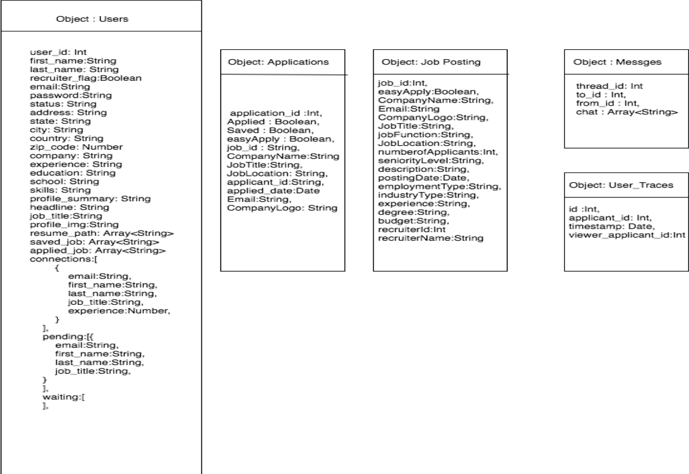
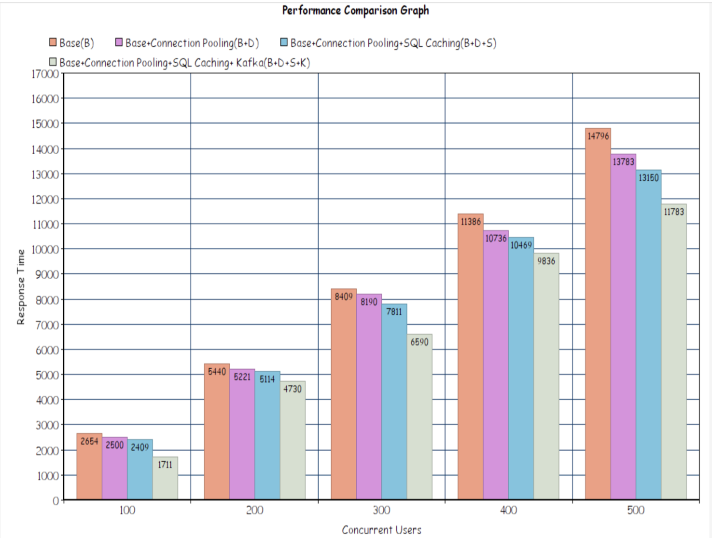
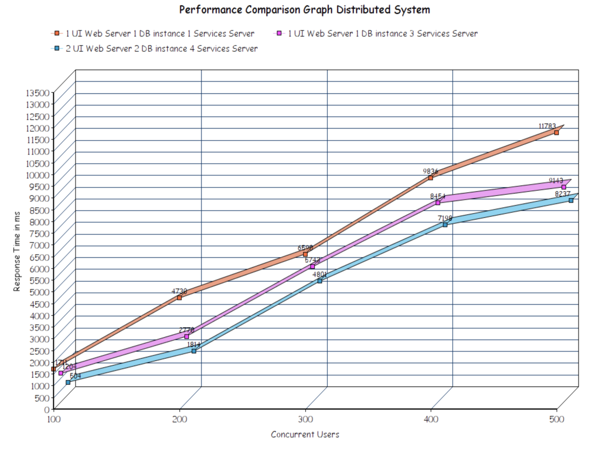

## Professional Networking 

### LinkedIn-Clone

 - Developed user profile, connections, job listing and application modules using <b>MERN Stack</b> and <b>Kafka</b>. 
 - Implemented Redis for data caching, containerized the application services and hosted on AWS. 
 - Implemented MongoDB replication and tested the performance on JMeter and Mocha. 

Developed by a team of 6 (please check contributors for more details).

## Application Link

<have_to_update>

## Application Architecture Diagram
 

## Database Schema
 

 
## Performace Trace ( JMeter Testing )

 
#### Features Provided

 - User Login and Sign Up
 - Recruiter Login and Sign Up
 - Search People
 - Search Jobs
 - Connect People / Recruiters
 - Easy Apply / Custom Apply
 - View Connections
 - Search Jobs based on Location, Company Name
 - Accept / Remove / Ignore Connections
 - Post Jobs
 - Specific To Recruiter 
 - Send / Receive Messages
 - View Half Filled Forms (specific to recruiter)
 - Number of views of your post (specific to recruiter)
 - View Clicks on your post (specific to recruiter)
 - View Number of Applicants of your post (specific to recruiter)
 - View Your Top Posts (specific to recruiter)
 

*Technologies Used*
 - React
 - Redux
 - Node
 - AWS RDS MySql
 - Mongo DB Cluster
 - Kafka
 - Plotly
 - S3 Buckets
 - Json Web Token
 

#### What is Kafka?
Kafka is a distributed messaging queue which is an imperative programming structure which is based event-driven programming.

###### Kafka Features
- Publish and subscribe messaging queue.
- Reacts to events in a real time
- High tolerance with highly available .

###### Kafka Semantics
- Atleast Once
- Atmost Once
- Only once (most difficult one)

#### Scaling Techniques
- Mongo DB Cluster with Replica sets
- Auto Scaling  groups with Elastic Load Balancing 
- AWS RDS Cluster

## Installation Requirements

For development, you will only need Node.js installed on your environement.
And please use the appropriate [Editorconfig](http://editorconfig.org/) plugin for your Editor (not mandatory).

### Node

[Node](http://nodejs.org/) is really easy to install & now include [NPM](https://npmjs.org/).
You should be able to run the following command after the installation procedure
below.

    $ node --version
    v0.10.24

    $ npm --version
    1.3.21

#### Node installation on Linux

    sudo apt-get install python-software-properties
    sudo add-apt-repository ppa:chris-lea/node.js
    sudo apt-get update
    sudo apt-get install nodejs

#### Node installation on Windows

Just go on [official Node.js website](http://nodejs.org/) & grab the installer.
Also, be sure to have `git` available in your PATH, `npm` might need it.

---

## Front End 
## Install

    $ git clone https://github.com/mssrinivas/LinkedIn-Clone.git
    $ cd LinkedIn-Clone/linkedin-frontend
    $ npm install

## Start & watch

    $ npm start

    
## Back End 
## Install

    $ git clone https://github.com/mssrinivas/LinkedIn-Clone.git
    $ cd LinkedIn-Clone/linkedin-backend/
    $ npm install

## Start & watch

    $ npm start
